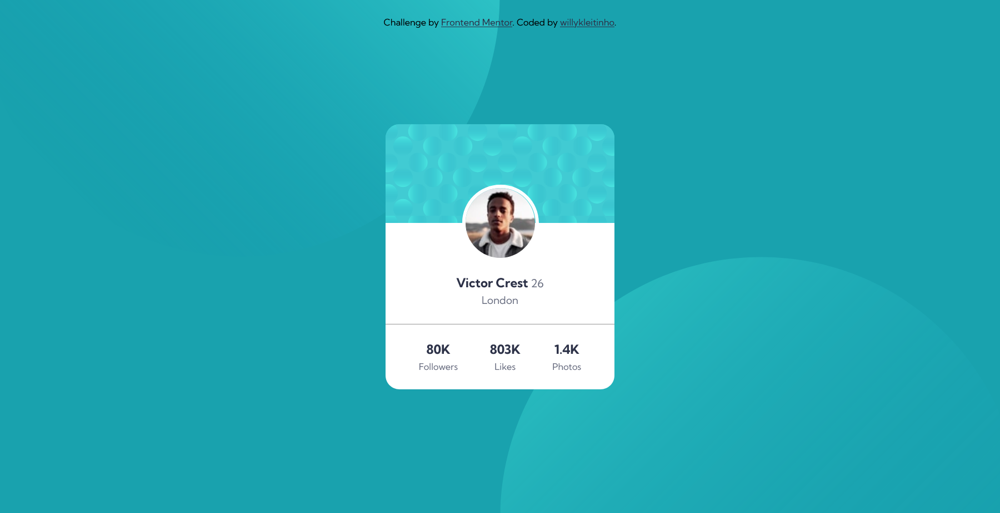

# Frontend Mentor - Profile card component solution

This is a solution to the [Profile card component challenge on Frontend Mentor](https://www.frontendmentor.io/challenges/profile-card-component-cfArpWshJ). Frontend Mentor challenges help you improve your coding skills by building realistic projects. 

## Table of contents

- [Overview](#overview)
  - [The challenge](#the-challenge)
  - [Screenshot](#screenshot)
  - [Links](#links)
- [My process](#my-process)
  - [Built with](#built-with)
  - [What I learned](#what-i-learned)
  - [Useful resources](#useful-resources)
- [Author](#author)

## Overview

### The challenge

- Build out the project to the designs provided

### Screenshot

### Links

- Solution URL: [on Frontend Mentor](https://your-solution-url.com)
- Live Site URL: [on Github Pages](https://willykleitinho.github.io/profile-card-component/)

## My process

### Built with

- CSS custom properties
- Flexbox
- Mobile-first workflow
- SVG

### What I learned

In this project, I practiced CSS organization (using BEM), positioning, and SVG scaling (that was a little bit hard).

### Useful resources

- [MDN](https://developer.mozilla.org/en-US/docs/Web) - Yeah
- [CSS Tricks - Using SVG](https://css-tricks.com/using-svg/) - This has helped me to use and understand SVG better.

## Author

- Website - [willykleitinho](https://github.com/willykleitinho)
- Frontend Mentor - [@willykleitinho](https://www.frontendmentor.io/profile/willykleitinho)